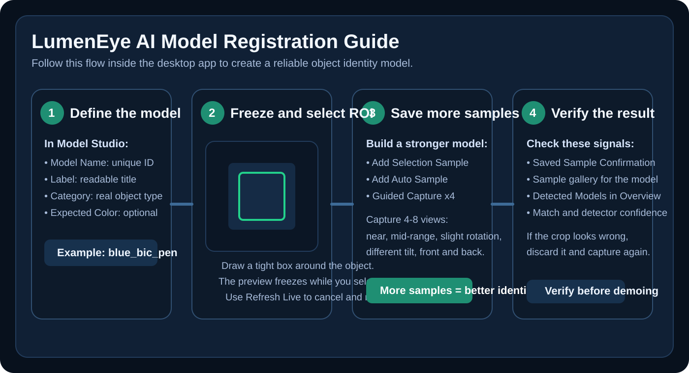

# LumenEye AI

LumenEye AI is a local desktop computer vision system for custom object identity detection.
It lets you define your own object models from a live camera feed, capture multiple samples,
and verify whether the object currently in view is the same object you registered earlier.

The project is designed for practical identity-aware recognition rather than generic object
classification alone. A model can be created for a specific device, accessory, tool, package,
or any other physical object you want to track and verify in a live scene.

## Core Capabilities

- Local desktop application with a live camera interface
- User-defined object models with multi-sample registration
- Open-vocabulary detection powered by YOLOWorld
- Identity verification using feature matching, appearance scoring, and object embeddings
- Self-face registration and presence signals
- Event timeline and model registry views
- Guided capture workflow for collecting multiple samples quickly

## How It Works

LumenEye AI uses a two-stage pipeline:

1. The detector searches the full frame for candidate objects using open-vocabulary prompts.
2. Each candidate is verified against the saved samples of your registered model before it is accepted as a match.

This makes the system more selective than a detector-only workflow and better suited for
recognizing a specific registered object instead of any item from the same broad category.

## Typical Use Cases

- Register a specific phone, watch, bottle, or product package and verify it in a live scene
- Build custom object identities for demos, prototypes, or computer vision experiments
- Compare visually similar objects and reject near-matches that are not the exact registered model
- Evaluate whether a registered object remains recognizable from different angles and distances

## Desktop Workflow

The main application is a local desktop app. You can:

- Create a new model with a custom name, label, category, and expected color
- Draw a region of interest over the object you want to save
- Freeze the preview while selecting the ROI
- Refresh the live feed if you want to cancel the current ROI
- Add multiple samples to the same model for better identity verification
- Review saved sample thumbnails for the selected model
- Monitor live matches, detector status, and event history

## Model Registration Guide



### Quick Start

1. Open the desktop app and go to `Model Studio`.
2. Fill in the model details:
   - `Model Name`: a unique internal ID such as `blue_bic_pen`
   - `Label`: a human-readable name such as `Blue Bic Pen`
   - `Category`: the real object type such as `pen`, `phone`, `bottle`, or `box`
   - `Expected Color`: optional, but useful for rejecting obvious mismatches
3. Draw a tight ROI around the object in the live preview.
4. Save the first sample with `Add Selection Sample`.
5. Confirm that the `Saved Sample Confirmation` preview looks correct.
6. Add more samples with:
   - `Add Selection Sample` for precise manual crops
   - `Add Auto Sample` for detector-assisted capture
   - `Guided Capture x4` for quick multi-angle collection

### What Good Registration Looks Like

- Use a real object category, not a placeholder like `test`.
- Capture 4 to 8 samples of the same object.
- Include different angles, slight rotation, and small distance changes.
- Keep the ROI tight so the object fills most of the selection.
- Re-capture any sample that includes too much background or cuts off part of the object.

### Common Mistakes

- Using `test` or another non-object word as the category
- Capturing only one or two samples
- Drawing a loose ROI with too much background
- Registering the object from one angle only and expecting it to work from every angle later

### Recommended Example

For a real phone registration:

- `Model Name`: `iphone16_white`
- `Label`: `iPhone 16 White`
- `Category`: `phone`
- `Expected Color`: `white`

For a pen:

- `Model Name`: `blue_bic_pen`
- `Label`: `Blue Bic Pen`
- `Category`: `pen`
- `Expected Color`: `blue`

## Installation

```bash
py -3.10 -m pip install -r requirements.txt
py -3.10 -m pip install https://github.com/ultralytics/CLIP/archive/refs/heads/main.zip
```

## Run

```bash
py -3.10 app.py
```

## Project Structure

- `app.py`: application entry point and runtime loop
- `desktop/`: desktop dashboard and UI workflow
- `vision/`: detector, object identity logic, and face processing
- `core/`: configuration, utilities, events, and rules
- `tests/`: automated tests for the model pipeline
- `tools/`: auxiliary scripts such as webcam field tests

## Webcam Field Test

You can run a practical webcam evaluation against a registered model:

```bash
py -3.10 tools\webcam_field_test.py --model blue_bic_pen --seconds 20 --show-window
```

The script reports:

- total frames
- matched frames
- match rate
- best match score
- best detector score
- prompts used during the session

This is useful for validating a model before a demo or presentation.

## Notes

- The system runs locally and does not require a cloud inference service for normal use.
- Recognition quality depends on the number and variety of samples you collect for each model.
- Very similar objects may still require more samples or stricter tuning for perfect separation.
